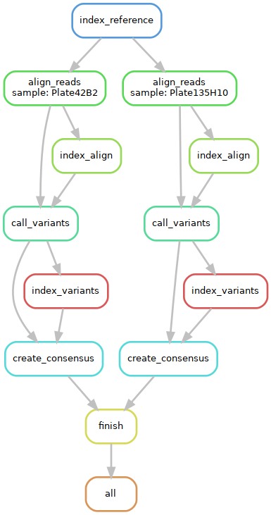
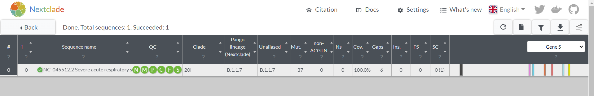
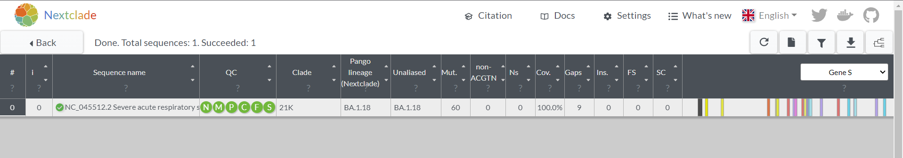

# sars-cov-hw
Sars-CoV-2 Lineage Determination homework for cancer genomics course.

## Task:
The goal of this exercise is to create a simple variant calling workflow for SARS-CoV-2 and please describe the steps of your workflow using markdown (GitHub Markdown). The workflow should contain steps to align the FASTQ files to the SARS-CoV-2 reference genome (bwa), call variants (bcftools) and annotate variants (VEP). Alternatively, you can also create a consensus sequence (bcftools) and classify the lineage (nextclade). Determine the most likely SARS-CoV-2 lineage (Alpha, Beta, Gamma, Delta or Omicron) for the below 2 data sets using the variant calls and/or the consensus sequence.

## Conda env setup
The tools for pipeline are specified in `environment.yml` and are installed using conda.
~~~
conda env create -f environment.yml
conda activate cg_sars_cov_env
~~~

## Run pipeline locally
The steps are executed as a Snakemake pipeline.

Whole pipeline can be executed as:
~~~
snakemake --cores 6
~~~

The pipeline consists of several steps as illustrated in above diagram:
* indexing of reference genome with `bwa index`
* alignment of reads with `bwa mem`
* indexing of the alignment with `samtools index`
* variant calling with `bcftools mpileup`
* indexing of variant calling file with `bcftools index`
* creating consensus sequence with `bcftools consensus`

## Results
Resulting consensus sequences for both datasets were uploaded to https://clades.nextstrain.org/ to classify the lineage.

**dataset 1 (Plate42B2)** has a lineage B.1.1.7 which corresponds to variant **Alpha**.

**dataset 2 (Plate135H10)** has a lineage BA.1.18 which corresponds to variant **Omicron**.

